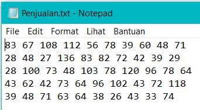

# Import Data

## scan

Berfungsi untuk membaca data ke dalam vektor atau list dari konsol atau file.

Sebelum berlanjut, buatlah terlebih dahulu file Penjualan.txt seperti pada gambar di bawah ini, lalu taruh di folder data.



```{r}
Penjualan = scan("data/Penjualan.txt")
Penjualan
```

Tipe data dari file yang dibaca oleh `scan` adalah vektor (bisa juga list)

```{r}
is.vector(Penjualan)
```

Sehingga kita juga bisa mengubahnya ke dalam bentuk matriks

```{r}
matrix(Penjualan, nrow = 5, ncol = 10)
```

Untuk melewati (skip) baris ke-2

```{r}
scan("data/Penjualan.txt", skip = 2)
```

## read.csv

```{r}
Data1 = read.csv("data/sensus.csv", sep = ";", header = TRUE)
Data1
```

```{r}
str(Data1)
```

## read.table

```{r}
Data2 = read.table("data/Sensus.txt", header = TRUE)
Data2
```

# Ekstrak Data

Mengambil kolom 2 pada Data1

```{r}

```

# Ringkasan Numerik Data

```{r}

```
